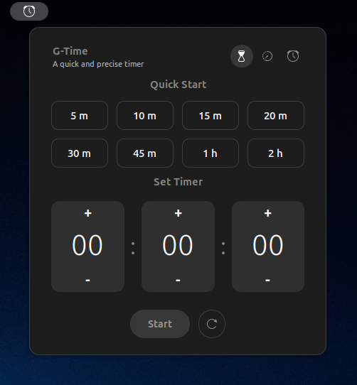
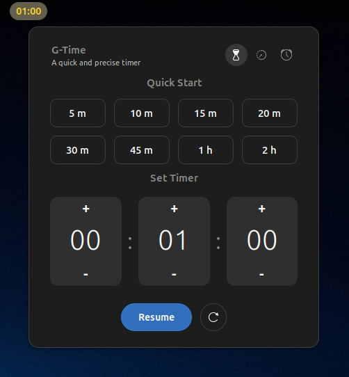
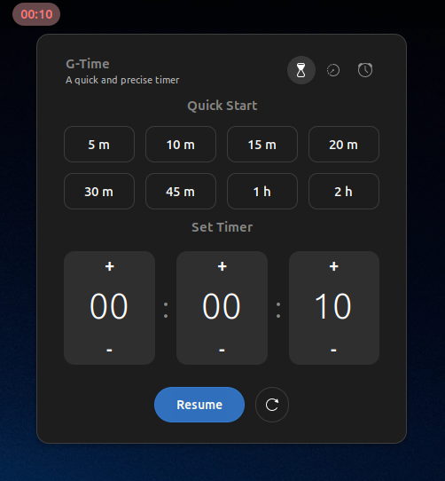
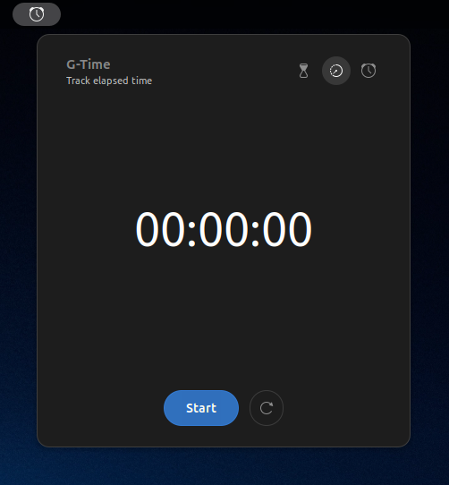
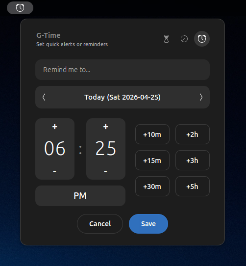
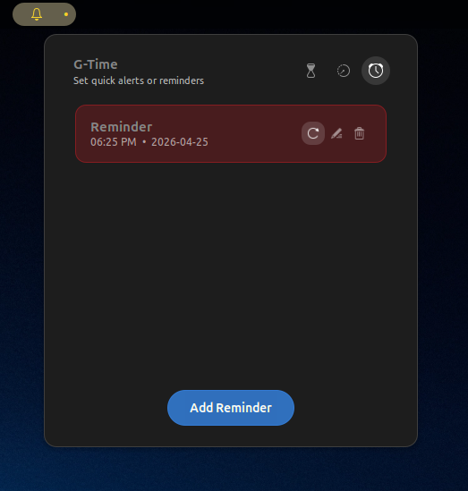

<div align="center">

# g-time ⏱️

> *A Professional Time Management Suite for GNOME Shell*

<!-- follow me on linkedin -->
<a href="https://www.linkedin.com/comm/mynetwork/discovery-see-all?usecase=PEOPLE_FOLLOWS&followMember=george-ezat" target="_blank">
    
</a>
<!-- follow me on github -->
<a href="https://github.com/george-ezat" target="_blank">
    
</a>
<!-- repo stars -->

<!-- repo last update -->

<!-- repo license -->


</div>

---

## Overview

**g-time** is a modern, modular, and user-friendly time management extension for GNOME Shell (v46+). It seamlessly integrates into your top panel, providing instant access to a powerful Timer, a precision Stopwatch, and a persistent Reminder system—all within a unified, elegant interface.

<div align="center">
    
    
    
    
    
    
</div>

---

## Features

- **Timer**
    - Additive quick start with presets (e.g., `+5m`, `+10m`, `+1h`).
    - Precision custom picker for hours, minutes, and seconds.
    - Smart input normalization (overflow auto-carried between units).
- **Stopwatch**
    - Dedicated tab for elapsed time tracking with pause, resume, and reset.
    - Continues running in the background when the menu is closed.
- **Reminders**
    - Set alerts for specific dates and times (AM/PM supported).
    - Native GNOME notifications and system sound alerts.
- **Dynamic Panel Integration**
    - Top bar dynamically displays active tools and aggregated counts.
    - Visual alerts: warning (yellow at 60s), critical (red at 10s).
- **Persistent Storage**
    - Reminders and timer states are saved between sessions.
- **Accessibility**
    - Keyboard-friendly UI and clear visual cues.

---

## Installation

### Method 1: GNOME Extension Manager (Recommended)
1. Download `g-time.zip` from the [Latest Release](https://github.com/george-ezat/g-time/releases/latest).
2. Open the **Extension Manager** app (available on Flathub or your distribution's software center).
3. Click the menu icon (three dots or hamburger) and select **Install from file...**
4. Select the downloaded `g-time.zip` file.

### Method 2: Command Line
1. Download `g-time.zip` from the [Latest Release](https://github.com/george-ezat/g-time/releases/latest).
2. Open your terminal and run:
    ```bash
    gnome-extensions install /path/to/your/downloaded/g-time.zip
    ```
3. Log out and log back in, or restart GNOME Shell (press Alt+F2, type r, and hit Enter on X11).
4. Enable the extension:
    ```bash
    gnome-extensions enable g-time@george-ezat.github.io
    ```

---

## Usage

Once installed and enabled, you will see the g-time icon in your GNOME top panel. Click the icon to access the Timer, Stopwatch, and Reminders tabs. Configure timers, start/stop the stopwatch, and set reminders as needed. All settings and reminders are saved automatically.

### Configuration

g-time is designed to work out-of-the-box. For advanced configuration, refer to the extension settings in the GNOME Extensions app or edit the configuration files directly if needed.

---

## Troubleshooting

- Ensure you are running GNOME Shell v46 or later.
- If the extension does not appear, try restarting GNOME Shell or logging out and back in.
- For installation issues, verify that the UUID is `g-time@george-ezat.github.io` and that the extension is enabled.
- Check the [GitHub Issues](https://github.com/george-ezat/g-time/issues) page for known problems or to report a new one.

---

## Contributing

Contributions, bug reports, and feature requests are welcome! Please open an issue or submit a pull request on [GitHub](https://github.com/george-ezat/g-time).

---

## License

This project is licensed under the GNU General Public License v2.0. See the [LICENSE](LICENSE) file for details.

---

## Author & Support

Created and maintained by [George Ezzat](https://github.com/george-ezat). For questions, suggestions, or support, please use the [GitHub Discussions](https://github.com/george-ezat/g-time/discussions) or connect via [LinkedIn](https://www.linkedin.com/comm/mynetwork/discovery-see-all?usecase=PEOPLE_FOLLOWS&followMember=george-ezat).
