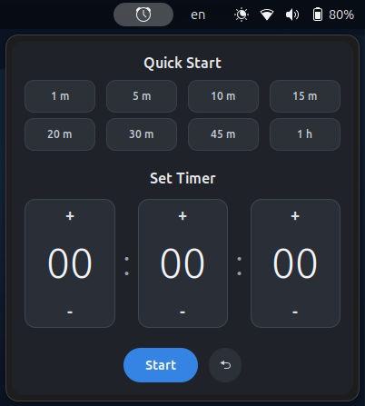

<div align=center>

# g-time ⏱️

> "I didn't find the timer I need, so I created mine."
<!-- follow me on linkedin -->
<a href="https://www.linkedin.com/comm/mynetwork/discovery-see-all?usecase=PEOPLE_FOLLOWS&followMember=george-ezat" target="_blank">
    
</a>
<!-- follow me on github -->
<a href="https://github.com/george-ezat" target="_blank">
    
</a>
<!-- repo stars -->

<!-- repo last update -->

<!-- repo license -->


</div>

---

A clean, quick-access timer and countdown extension for GNOME Shell (`46+`). `g-time` integrates directly into your top panel, offering both quick-start presets and a precise custom timer picker.

<div align=center>


</div>


## Features
* **Quick Start:** 1m to 1h presets for immediate countdowns.
* **Custom Timer:** Clickable and keyboard-friendly picker UI to set exact hours, minutes, and seconds.
* **Smart Input Normalization:** Overflow is auto-carried between units (for example, entering `65` in minutes becomes `01:05`).
* **Panel Integration:** Shows remaining time directly in the GNOME panel when active.
* **Focused Countdown Display:** While the timer is running, only the countdown text is shown in the top bar.
* **End-of-Timer Visual Alerts:** The panel indicator changes style as time approaches zero (warning and critical states).
* **Native Notifications:** Triggers the default GNOME alert when the time is up.

## Installation

### Method 1: Via GNOME Extension Manager (Recommended)
1. Download the `g-time.zip` file from the [Latest Release](https://github.com/george-ezat/g-time/releases/latest) page.
2. Open the **Extension Manager** app (available on Flathub or your distribution's software center).
3. Click the menu icon (three dots or hamburger) and select **Install from file...**
4. Select the downloaded `g-time.zip` file.

### Method 2: Via Command Line
1. Download the `g-time.zip` file from the [Latest Release](https://github.com/george-ezat/g-time/releases/latest) page.
2. Open your terminal and run:
   ```bash
   gnome-extensions install /path/to/your/downloaded/g-time.zip
3. Log out and log back in, or restart GNOME Shell (press Alt+F2, type r, and hit Enter on X11).
4. Enable the extension:
    ```bash
    gnome-extensions enable g-time@george-ezat.github.io
    ```

---